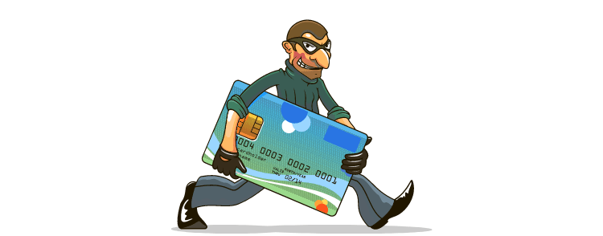

# **🦹‍♂️ Credit Card Fraud Detection 💳**  

  

## **1. Project Overview 🧐**
This project focuses on building and evaluating different machine learning classification models to detect fraudulent credit card transactions. Credit card fraud is a critical issue in the financial industry, causing significant financial losses and damaging customer trust. Detecting fraud effectively is challenging because fraudulent transactions are extremely rare compared to legitimate ones, resulting in a highly imbalanced dataset.

## **2. Goals 🎯**
  - Handle class imbalance effectively using SMOTE and undersampling techniques.
  - Train and compare multiple models.
  - Perform extensive exploratory data analysis (EDA).
  - Apply feature engineering and scaling techniques.
  - Focus on maximizing recall to reduce false negatives.

## **3. Dataset 📂**

- **Source:** [Kaggle - Credit Card Fraud Detection](https://www.kaggle.com/datasets/mlg-ulb/creditcardfraud).
- **Size:** The dataset contains 284,807 transactions.  
- **Duration:** The dataset contains transactions made over a period of two days.
- **Features:**
  - 28 anonymized PCA features: V1 to V28.
  - Time and Amount.
  - Target class: 0 (legit), 1 (fraud).

> Note: Only 0.17% of the transactions are fraud, creating a severe class imbalance. This makes fraud detection especially challenging and necessitates the use of techniques such as SMOTE and undersampling to ensure models are trained effectively on minority class instances.

## **4. Models Implemented 🛠**
Trained and evaluated the following models:
  - Logistic Regression.
  - Decision Tree.
  - Random Forest.
  - KNN.
  - XGBoost.

## **5. Evaluation Metrics 📈**
We used the following metrics for model performance:
  - Precision.
  - Recall
  - F1-score
  - PR Curve

> Given the nature of the problem, Recall was prioritized to ensure that as many fraudulent transactions as possible are detected. False negatives (fraud cases predicted as legitimate) can be very costly and damaging.

---
